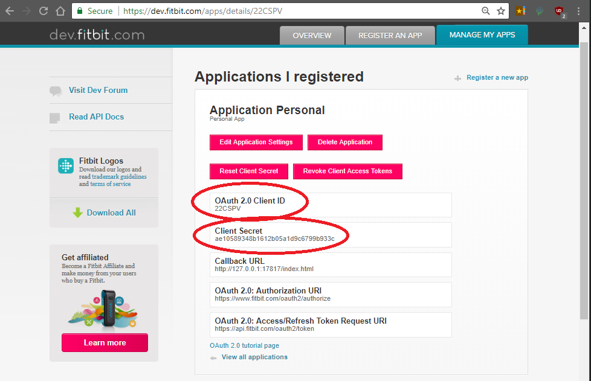

# FitBitSaveData

Downloads all of the Fit Bit data localy and saves it as native JSON, ready for farther processing.

# Setup

## Step 1: Register FitBit Private App

You will need clientID and clientSecret. To get them you need to register an personal app. with FitBit: https://dev.fitbit.com/apps/new


## Step 2: Save App Info



## Step 3: Enter the info into fitbit.ini (rename fitbit-sample.ini):
```
[FitBitPrivateAppInfo]  
clientID=  
clientSecret=  
callbackURL=http://127.0.0.1:17817/index.html

[main]
DownloadGeneralData=1
DownloadSleepLog=1
DownloadActivityLog=1
DownloadTimeSeries=1
DownloadOnceADay=0
; FitBit APIs have a limit of 150 calls per hour.
; If you want to wait after the limit is reached to continue data download set waitOutLimit = 1
; Default: waitOutLimit=0
waitOutLimit=1
getAuthorizationCode=1


[GeneralDataToDownload]
profile=https://api.fitbit.com/1/user/-/profile.json
devices=https://api.fitbit.com/1/user/-/devices.json
friends=https://api.fitbit.com/1/user/-/friends.json
leaderboard=https://api.fitbit.com/1/user/-/friends/leaderboard.json
badges=https://api.fitbit.com/1/user/-/badges.json
foodFavorite=https://api.fitbit.com/1/user/-/foods/log/favorite.json
foodFrequent=https://api.fitbit.com/1/user/-/foods/log/frequent.json
sleepGoal=https://api.fitbit.com/1/user/-/sleep/goal.json
activities=https://api.fitbit.com/1/user/-/activities.json
activitiesRecent=https://api.fitbit.com/1/user/-/activities/recent.json
activitiesFavorite=https://api.fitbit.com/1/user/-/activities/favorite.json
activitiesFrequent=https://api.fitbit.com/1/user/-/activities/frequent.json
activitiesGoals=https://api.fitbit.com/1/user/-/activities/goals/daily.json

[TimeSeriesToDownload]
body=https://api.fitbit.com/1/user/-/body/date/%date%.json
bodyWeight=https://api.fitbit.com/1/user/-/body/weight/date/%date%/1d.json

foods=https://api.fitbit.com/1.1/user/-/foods/log/date/%date%.json
water=https://api.fitbit.com/1.1/user/-/foods/log/water/date/%date%.json

activities=https://api.fitbit.com/1/user/-/activities/date/%date%.json
heart=https://api.fitbit.com/1/user/-/activities/heart/date/%date%/1d/1min.json
heartSec=https://api.fitbit.com/1/user/-/activities/heart/date/%date%/1d/1sec.json
steps=https://api.fitbit.com/1/user/-/activities/steps/date/%date%/1d/1min.json
floors=https://api.fitbit.com/1/user/-/activities/floors/date/%date%/1d/1min.json
elevation=https://api.fitbit.com/1/user/-/activities/elevation/date/%date%/1d/1min.json
distance=https://api.fitbit.com/1/user/-/activities/distance/date/%date%/1d/1min.json
calories=https://api.fitbit.com/1/user/-/activities/calories/date/%date%/1d/1min.json
caloriesBMR=https://api.fitbit.com/1/user/-/activities/caloriesBMR/date/%date%/1d/1min.json
minutesSedentary=https://api.fitbit.com/1/user/-/activities/minutesSedentary/date/%date%/1d/1min.json
minutesLightlyActive=https://api.fitbit.com/1/user/-/activities/minutesLightlyActive/date/%date%/1d/1min.json
minutesFairlyActive=https://api.fitbit.com/1/user/-/activities/minutesFairlyActive/date/%date%/1d/1min.json
minutesVeryActive=https://api.fitbit.com/1/user/-/activities/minutesVeryActive/date/%date%/1d/1min.json
activityCalories=https://api.fitbit.com/1/user/-/activities/activityCalories/date/%date%/1d/1min.json

sleepLevels=https://api.fitbit.com/1.2/user/-/sleep/date/%date%.json
sleep=https://api.fitbit.com/1.1/user/-/sleep/date/%date%.json
```

## Step 4: Compile using Autoit Beta

You can also download the compiled one.

## Step 5: Run fitbitDownload.exe


What you get:  
